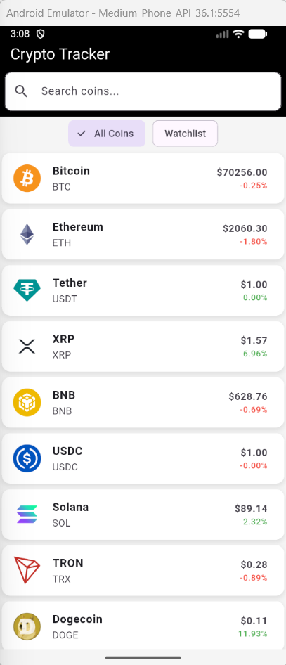
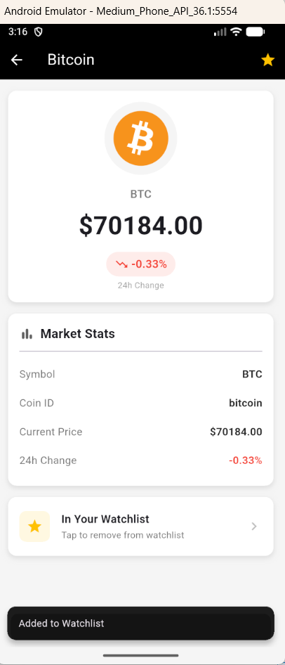

# Crypto Tracker

A Flutter application for tracking cryptocurrency prices and managing a personal watchlist.

## Screenshots

| Home Page                               | Detail Page                                 |
| --------------------------------------- | ------------------------------------------- |
|  |  |

## Features

- **Live Crypto Prices**: View real-time cryptocurrency prices and 24-hour price changes
- **Search**: Quickly find coins by name or symbol
- **Watchlist**: Save your favorite coins for easy tracking
- **Detailed View**: See comprehensive market stats for each coin
- **Pull to Refresh**: Update prices with a simple pull gesture

## Project Structure

```
lib/
├── main.dart                 # App entry point and theme configuration
├── components/
│   ├── coin_tile.dart        # Reusable coin list item widget
│   └── error_display.dart    # Error state widget
├── models/
│   └── coin.dart             # Coin data model
├── services/
│   ├── api_service.dart      # API calls for fetching coin data
│   └── storage_service.dart  # Local storage for watchlist
└── views/
    ├── home_screen.dart      # Main screen with coin list
    └── detail_screen.dart    # Individual coin details
```

## Getting Started

### Prerequisites

- Flutter SDK (3.0 or higher)
- Dart SDK
- Android Studio / VS Code with Flutter extension

### Installation

1. Clone the repository:

   ```bash
   git clone <repository-url>
   cd SoftwarePersonaFlutterProject
   ```

2. Install dependencies:

   ```bash
   flutter pub get
   ```

3. Run the app:
   ```bash
   flutter run
   ```

## Dependencies

- `flutter/material.dart` - Material Design widgets
- `shared_preferences` - Local storage for watchlist persistence
